# 🏡 Predicting Real Estate Listing Success and Price Optimization Using Structural, Locational, and Textual Market Features

A machine learning pipeline from end to end to predict prices of listings and whether the listings will be sold or not in the states of Texas and New York, using structural features, geographic encodings, and text features from natural language processing derived text signals through a tuned, stacked ensemble.


---

## 📑 Table of Contents

- [Overview](#-overview)
- [Key Results](#-key-results)
- [Workflow](#-workflow)
- [Repository Structure](#-repository-structure)
- [Datasets](#-datasets)
- [Methodology](#-methodology)
- [Tech Stack](#-tech-stack)
- [Getting Started](#-getting-started)
- [Detailed Results](#-detailed-results)
- [Business Recommendations](#-business-recommendations)
- [Limitations & Future Work](#-limitations--future-work)

---

## 📖 Overview

The conventional automated valuation models (AVMs) depend heavily on structural features. These include bedrooms, bathrooms, and area. The current study explores the significance of **location** and **text description of listings** beyond these structural variables for prediction, and employing a well-validated leakage-proof model pipeline based on **119,979 listings** from two states with distinct structures.

**Three research questions drive the project:**

1. Can a stacked ensemble of diverse models outperform any single tuned model?
2. How much does each feature group — structural, location, text — actually contribute, isolated through a controlled ablation study?
3. Can the same feature set also predict whether a listing sells at all?

---

## 🏆 Key Results

| Metric | Result |
|---|---|
| **Best model (Ridge Stack)** | Test R² = **0.7869**, Real-dollar MAE = **$62,473** |
| **Best classifier (HistGradientBoosting)** | Test AUC-ROC = **0.7707** |
| **Ablation — structural only** | R² = 0.3418 |
| **Ablation — + location** | R² = 0.7768 (**+0.3073 RMSE reduction** — the dominant signal) |
| **Ablation — + text (NLP)** | R² = 0.7781 (+0.0013 — see [limitations](#-limitations--future-work)) |
| **SHAP importance split** | Structural 70.2% · Location 29.6% · NLP 0.2% |

---

## 🔄 Workflow

```mermaid
flowchart LR
    subgraph Prep["1. Data Preparation"]
        A["4 Kaggle datasets\n(2.8M raw rows)"] --> B["Cleaning\n(impute, dedupe, outliers)"]
        B --> C["Feature Engineering\n(+8 features + NLP profile)"]
        C --> D["Stratified Split\n(119,979 rows)"]
    end

    subgraph Model["2. Modeling & Stacking"]
        E["4 Base Models\n(Optuna-tuned)"] --> F["OOF Stacking\n(5-fold CV)"]
        F --> G["Ridge Meta-Learner"]
        G --> H["Stacked Ensemble\nR²=0.7869"]
    end

    subgraph Insight["3. Evaluation & Insight"]
        I["Model Evaluation\n(R², AUC-ROC, MAE)"] --> J["Interpretability\n(SHAP + Ablation)"]
        J --> K["Business\nRecommendations"]
    end

    D --> E
    H --> I
```




---

## 📂 Repository Structure

```
├── notebooks/
│   ├── NB1_Data_Cleaning_and_Feature_Engineering.ipynb
│   ├── NB2_Baseline_Models.ipynb
│   ├── NB3_Hyperparameter_Tuning_Optuna.ipynb
│   ├── NB4_Stacking_and_OOF_Validation.ipynb
│   ├── NB5_Regression_Evaluation_and_Results.ipynb
│   ├── NB6_Classification_Ablation_SHAP.ipynb
│   └── NB7_Interpretability_and_Business_Insights.ipynb
├── report/
│   └── Project_Report.docx
├── outputs/
│   ├── figures/
│   └── model_results/
└── README.md
```

> Notebooks are chained via checkpointed state (`dill` + Google Drive), so each one restores exactly where the previous notebook left off — see [Getting Started](#-getting-started).

---

## 🗃 Datasets

| Dataset | Raw Rows | Cleaned Rows | Role |
|---|---|---|---|
| **SAKIB** | 2,226,382 | 2,045,281 | Structured prices — all US states |
| **POLARTECH** | 600,000 | 565,209 | Structured prices — all US states |
| **TEXAS 2026** | 12,137 | 11,942 | Free-text descriptions — TX only |
| **NEW YORK 2026** | 8,273 | 8,193 | Free-text descriptions — NY only |

⚠️ **Note:** the structured price datasets and the description datasets do **not** share a common listing ID. Text features are therefore aggregated to a state-level profile (VADER sentiment, Flesch readability, luxury-keyword density) rather than attached per listing — see [Limitations](#-limitations--future-work).

---

## 🧪 Methodology

| Stage | What happens |
|---|---|
| **Cleaning** | PII removal, deduplication, MICE imputation, IQR outlier fencing, state-name normalization |
| **Feature Engineering** | Log-transformed house size, price-per-sqft, bed/bath ratio, leak-free ZIP/city median price encodings, 14-column NLP profile |
| **Base Models** | Random Forest, CatBoost, a residual MLP, HistGradientBoosting — each baseline-tested, then tuned via **Optuna** (TPE sampler) |
| **Stacking** | 5-fold out-of-fold predictions → **Ridge** meta-learner, avoiding meta-learner leakage |
| **Classification** | Same 4 model families + Logistic Regression, predicting sold vs. active |
| **Interpretability** | **SHAP** (TreeExplainer), **permutation importance**, and a **3-way ablation study** (structural → +location → +NLP), cross-validated against each other |

---

## 🛠 Tech Stack

- **Modeling:** scikit-learn, CatBoost, TensorFlow/Keras, Optuna
- **Interpretability:** SHAP, permutation importance
- **NLP:** VADER, YAKE, textstat
- **Data:** pandas, NumPy
- **Visualization:** matplotlib, seaborn
- **Environment:** Google Colab (7 linked notebooks, state persisted via `dill`)

---

## 🚀 Getting Started

1. Open `notebooks/NB1_...ipynb` in Google Colab.
2. Mount your Google Drive when prompted — each notebook reads/writes its checkpoint under:
   ```
   /content/drive/MyDrive/RealEstate_TXNY/checkpoints/
   ```
3. Run notebooks **in order (NB1 → NB7)** — each restores state from the previous notebook's checkpoint automatically, so you don't need to re-run earlier notebooks in the same session.
4. Final outputs (figures, result tables) are written to the same `RealEstate_TXNY` folder on Drive.

---

## 📊 Detailed Results

### Regression (Test Set)

| Model | Test R² | Test RMSE | Real-Dollar MAE |
|---|---|---|---|
| Random Forest | 0.7867 | 0.4189 | $62,237 |
| CatBoost | 0.7779 | 0.4282 | $67,420 |
| MLP (residual) | 0.7580 | 0.4506 | $71,728 |
| HistGradientBoosting | 0.7755 | 0.4302 | $71,389 |
| **Ridge Stack (best)** | **0.7869** | **0.4187** | **$62,473** |

### Classification (Test Set)

| Model | AUC-ROC |
|---|---|
| **HistGradientBoosting (best)** | **0.7707** |
| CatBoost | 0.7681 |
| Soft Ensemble | 0.7663 |
| Random Forest | 0.7613 |
| MLP Classifier | 0.7069 |
| Logistic Regression | 0.5665 |

### SHAP Top-5 Features (mean \|SHAP\|)

`price_per_sqft` (0.363) → `city_median_price` (0.128) → `log_house_size` (0.119) → `house_size` (0.118) → `longitude` (0.091)

---

## 💡 Business Recommendations

1. **Pricing based on ZIP codes as the anchor** — location attributes helped achieve the largest leap in accuracy.
2. **Invest in improving the text, but on a per-listing basis** — the low NLP contribution does not prove that the text is irrelevant; there are simply problems with the data join.
3. **Employ the stacked ensemble in production** — it always beats any individual model.
4. **Employ the classifier to identify listings** — tag those in the lowest quartile of expected sale probability.

---

## ⚠️ Limitations & Future Work

- **NLP Aggregation at State Level**: The description datasets do not have the same ID as the structured prices, and therefore all text features have been computed on state level means rather than listing-level variables – thus underestimating the effect of text ( e.g. Bushuyev et al., 2024; Kania Štykar, 2025 for row-level examples).
- **30.4% Missing ZIP Codes**, managed through city-level backup.
- **Random (rather than temporal) split into training/test data** - potentially a slightly optimistic generalization performance estimate.
- **Future research**: Obtain a dataset with actual listings price-description joins; use a temporal split into training/test data; geocode the addresses to address the ZIP missingness problem.

---
